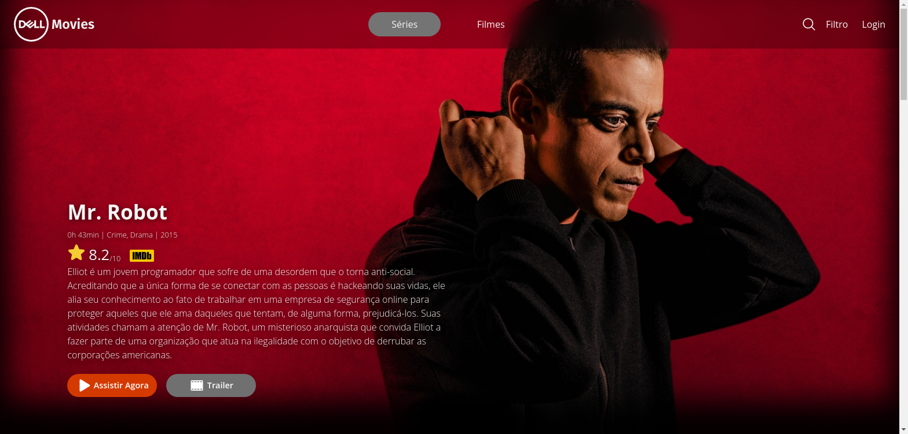

# [Dell Movies](https://dell-movies.netlify.app/movie)

Resolução do desafio final do curso Desenvolvedor Front-end - Vai Na Web. O desafio consiste em desenvolver a interface de um site fictício (Dell Movies) que tem como objetivo mostrar filmes e seriados, utilizando os dados da API [The Movie DB](https://www.themoviedb.org/). Além do desenvolvimento da interface, também foi requisitado que a página tenha funcionalidades e interações com o usuário, como diferentes rotas, animações, pesquisar por títulos e gêneros, paginação e entres outras.



## 🔗 Link
- [dell-movies.netlify.app](https://dell-movies.netlify.app/movie)

## 🧰 Tecnologias
- [React](https://react.dev/)
- [React Router Dom](https://reactrouter.com/en/main)
- [Vite](https://vitejs.dev/)
- [Styled Components](https://styled-components.com/)
- [Phosphor Icons](https://phosphoricons.com/)
- [React Responsive](https://github.com/yocontra/react-responsive)
- [Axios](https://axios-http.com/ptbr/docs/intro)
- [React Elastic Carousel](https://sag1v.github.io/react-elastic-carousel/)


## 🏃 Rodando em sua máquina

Para que você consiga utilizar a API do [The Movie DB](https://www.themoviedb.org/), você vai precisar de uma conta na plataforma e gerar seu próprio Bearer Token, [neste link](https://www.themoviedb.org/settings/api).

```bash 
# Clone o repositório
$ git clone https://github.com/CauaRodrigues/vnw-dell-movies.git dellmovies

# Entre na pasta e faça a instalação dos pacotes utilizados
$ cd dellmovies
$ yarn install
# ou, se você utiliza npm
$ npm install

# Copie seu Token de Acesso e a Base Url da API e cole em um arquivo .env na raiz do projeto.
# Desse modo:
VITE_APP_API_BASE_URL=<base_url>
VITE_APP_API_ACCESS_TOKEN=Bearer <your_access_token>

# Inicie a aplicação
$ yarn run dev
# ou
$ npm run dev
```